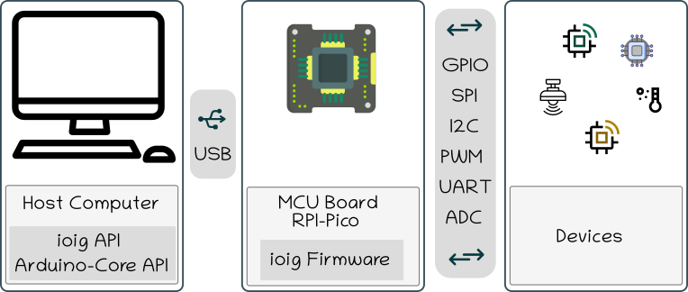

# IOIG - Input/Output Integration Gateway

IoIg (Input/Output Integration Gateway) empowers any USB host device with versatile communication capabilities across various interfaces/protocols including I2C, GPIO, SPI, Serial (UART), and Analog, fostering seamless connectivity and integration across diverse sensors ecosystems.

Existing market devices often fall short in interrupt handling and protocol mixing capabilities. After testing of prominent devices like FT4232H, FT4222HQ, FT2232, and MCP2210, we identified significant limitations that inspired the development of IoIg. The primary drawback of these devices lies in their constraints on interrupt numbers and the complexity involved in simultaneously managing multiple protocols. IoIg addresses these shortcomings, providing a solution that unlocks versatility in USB host device communication.

Additionally, we have developed a simple and consistent C++ API that can be used on any compatible host(Linux, Windows, MacOS and Android). 
Currently, we also support the **Arduino Core API**, which can be used in the project and will provide the possibility of running any Arduino code on the host side along with the power of modern multi-threaded C++.

Having the Arduino API on the host has several advantages: One of them is directly supporting any Arduino compatible module device. The second advantage is simplifying code debugging. Another advantage is not needing to flash firmware every time a device driver is modified.

The current firmware supports [The Raspberry Pi Pico](https://www.raspberrypi.com/products/raspberry-pi-pico/) board. We are currently planning to port the firmware to Zephyr OS to extend support to other boards.

- Features:

    - USB CDC protocol
    - USB 1.0/1.1: Full-Speed: 12 Mbps
    - Async Interrupt Events (no poll)
    - 64 bytes packets (~60 bytes payload)
    - Arduino API Support

- Roadmap:
    - Port firmware to [Zephyr OS](https://www.zephyrproject.org/)

Related projects : [u2if](https://github.com/execuc/u2if), [Adafruit Blinka](https://github.com/adafruit/Adafruit_Blinka).

## Setup 

### Linux

#### Install required packages:

Tested on Ubuntu 22.04.3 LTS

~~~
sudo apt update
sudo apt install git cmake g++ gcc-arm-none-eabi libusb-1.0-0 libusb-1.0-0-dev pkg-config python3
~~~

#### Set USB Permissions:

Note: IoIg uses tinyUSB's default VID/PID.

Create a file *99-ioig.rules* with the content bellow:

~~~
# Rule applies to all IoIg
ATTRS{idVendor}=="cafe", MODE="0666", GROUP="dialout"

# Rule to blacklist IoIg from being manipulated by ModemManager.
SUBSYSTEMS=="usb", ATTRS{idVendor}=="cafe", ENV{ID_MM_DEVICE_IGNORE}="1"
~~~

Copy the file *99-ioig.rules* to the location of your distribution's udev rules.
For example on Ubuntu:
   sudo cp 99-ioig.rules /etc/udev/rules.d/

Reload udev rules:

~~~
sudo udevadm control --reload-rules
sudo udevadm trigger
~~~

#### Download & Build IoIg

~~~
cd ~/ #default folder, change it if needed 
git clone https://github.com/Ingecom-Fr/ioig.git
cd ioig
mkdir build && cd build
cmake -G "Unix Makefiles" -DIOIG_FW=1 -DIOIG_TESTS=1 ..
make
~~~

#### Flash Firmawre:

Once build is done, the firmware is located in /path/to/ioig/build/fw folder.

 * Find the BOOTSEL button on your Raspberry Pi Pico. 
 * Press the BOOTSEL button and hold it while you connect the other end of the micro USB cable to your computer.
 * Release the BOOTSEL button once the USB cable is connected.
 * The folder **RPI-RP2** should be automatically mounted on your computer. Otherwise you should mount it manually.
 * Copy the file *build/fw/ioig_fw.uf2* in RPI-RP2 folder; The firmware is fashed automatically once copied
   * Linux: cp /path/to/ioig/build/fw/ioig_fw.uf2 /media/$USER/RPI-RP2
   * Windows : Copy the file *build/fw/ioig_fw.uf2* into the drive called RPI-RP2
 * The Pico LED should start blinking after flashing.

Follow the section [Run IoIg tests](#run-ioig-tests) to execute automatic tests

### Windows

Tested on Windows 10/11

#### Install required packages:

 * Install [MSYS2](https://www.msys2.org/) on Windows
 * Download the executable [Zadig](https://zadig.akeo.ie/)

Once installed, open **MSYS2 UCRT64** terminal as administrator from windows menu.

Run the following command:

~~~
pacman -S git make mingw-w64-ucrt-x86_64-cmake mingw-w64-ucrt-x86_64-fmt mingw-w64-ucrt-x86_64-gcc mingw-w64-ucrt-x86_64-libusb mingw-w64-ucrt-x86_64-make mingw-w64-ucrt-x86_64-arm-none-eabi-gcc mingw-w64-ucrt-x86_64-python mingw-w64-ucrt-x86_64-pkgconf mingw-w64-ucrt-x86_64-libc++
~~~

#### Download & Build IoIg

~~~
cd ~/ #default folder, change it if needed 
git clone https://github.com/Ingecom-Fr/ioig.git
cd ioig
mkdir build && cd build
cmake -G "Unix Makefiles" -DIOIG_FW=1 -DIOIG_TESTS=1 ..
make
~~~

#### Flash Firmawre:

Once build is done, the firmware is located in /path/to/ioig/build/fw folder.

 * Find the BOOTSEL button on your Raspberry Pi Pico. 
 * Press the BOOTSEL button and hold it while you connect the other end of the micro USB cable to your computer.
 * Release the BOOTSEL button once the USB cable is connected.
 * The folder **RPI-RP2** should be automatically mounted on your computer. Otherwise you should mount it manually.
 * Copy the file *build/fw/ioig_fw.uf2* in RPI-RP2 folder; The firmware is fashed automatically once copied
   * Linux: cp /path/to/ioig/build/fw/ioig_fw.uf2 /media/$USER/RPI-RP2
   * Windows : Copy the file *build/fw/ioig_fw.uf2* into the drive called RPI-RP2
 * The Pico LED should start blinking after flashing.

#### Install WinUSB Driver using Zadig:

Launch *Zadig* executable as administrator

Click on menu *Options*:

  * **Check** the option: List All Devices  
  * **Uncheck** the option: Ignore Hubs or Composite Parents

Select *IoIg Multi Protocol Dongle* on Device List:

NOTE: **DO NOT SELECT** 'IoIg Data Interface' or 'IoIg Event Interface'. Ensure that the selection is 'IoIg Multi Protocol Dongle'.

  * Select (WinUSB) on *Target Driver* box -> Click on Reinstall Driver Button   

Open the Device Manager and check if the *IoIg Multi Protocol Dongle* device is present.
If the IoIg device is present in device list, the windows setup is ok. 

Follow the section [Run IoIg tests](#run-ioig-tests) to execute automatic tests

### MacOS

**Install required packages:**

~~~
brew install cmake git
brew tap ArmMbed/homebrew-formulae
brew install arm-none-eabi-gcc libusb pkg-config
~~~

**Set USB Permissions:**

~~~
sudo nvram usb-devices="cafe:4002"
sudo nvram usb-devices="allow"
~~~

#### Download & Build IoIg

~~~
cd ~/ #default folder, change it if needed 
git clone https://github.com/Ingecom-Fr/ioig.git
cd ioig
mkdir build && cd build
cmake -G "Unix Makefiles" -DIOIG_FW=1 -DIOIG_TESTS=1 ..
make
~~~

#### Flash Firmawre:

Once build is done, the firmware is located in /path/to/ioig/build/fw folder.

 * Find the BOOTSEL button on your Raspberry Pi Pico. 
 * Press the BOOTSEL button and hold it while you connect the other end of the micro USB cable to your computer.
 * Release the BOOTSEL button once the USB cable is connected.
 * The folder **RPI-RP2** should be automatically mounted on your computer. Otherwise you should mount it manually.
 * Copy the file *build/fw/ioig_fw.uf2* in RPI-RP2 folder; The firmware is fashed automatically once copied
   * Linux: cp /path/to/ioig/build/fw/ioig_fw.uf2 /media/$USER/RPI-RP2
   * Windows : Copy the file *build/fw/ioig_fw.uf2* into the drive called RPI-RP2
 * The Pico LED should start blinking after flashing.

Follow the section [Run IoIg tests](#run-ioig-tests) to execute automatic tests

## Samples

Some code examples using the Arduino API and the Native API can be found in the examples/arduino and examples/ioig folders, respectively.
Once the project is built, all binaries are created in the build/examples folder. Note that some examples require an RPI-PICO board and peripheral devices to run, which may involve additional wiring.

To create a new example, simply add a .cpp file to either the examples/arduino or examples/ioig folder, delete all build files, and rebuild the project from scratch.
Arduino sketches found online can be placed in the examples/arduino folder. They should build and work as expected.

## Run IoIg tests

The tests app will run automatic tests to check if IoIg is working properly.

Tests Hardware Requirements: 

  * Raspberry PI PICO board
  * Connection wires.
   
The test app will display a message to instruct how to create the physical wiring necessary to execute tests:

In tests folder, you'll find the ioig_tests app 

Run the commands bellow:

~~~
cd ~/ioig/build/host/tests
./ioig_tests
~~~

## Debugging IoIg USB protocol

The UART0 interface on the RPI-PICO is the default for displaying debug messages from the firmware. 
Some examples or tests rely on this interface, so ensure it is not activated when running code that uses UART0.
To desactivate it, use the value 0 of this line in fw/CMakeLists.txt file: 

~~~
pico_enable_stdio_uart(${IOIG_FW} 0) 
~~~

### Wireshark debug

~~~
sudo modprobe usbmon
sudo setfacl -m u:$USER:r /dev/usbmon*
~~~

Search IoIg USB bus and device using lsusb: 

~~~
lsusb 
Bus 001 Device 029: ID cafe:4003 INGECOM IoIg Multi Protocol Dongle
~~~

usbmon1 = USB bus 1 

On whireshark:
1.29.2 => bus=1 , device=29

Filter example (replace the bus and device numbers to match the IoIg on your system):

~~~
usb.src matches "(1\.29\.[0-9])" || usb.dst matches  "(1\.29\.[0-9])"
~~~

